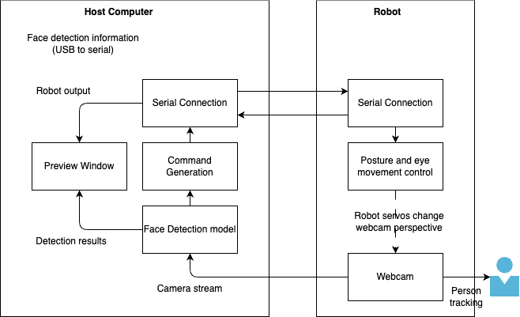

# Camera Follower Bot

[](#)
[](#)
[](#)


## Project Overview

Camera Follower Bot is a lightweight, real-time camera tracking system that detects faces and poses, then drives a microcontroller via serial communication to physically track them. This project is a robust, testable, and scriptable rework of the original "camera follower robot" project by Will Cogley (https://willcogley.notion.site/).

It is designed for hobbyists and developers who want to build a camera-based tracking robot using Python, MediaPipe, OpenCV, and a microcontroller such as the Raspberry Pi Pico running MicroPython.

Table of Contents
- Features
- Usage
- Development
- Contributing
- License

Features/improvements
--------
- Real-time camera processing using MediaPipe / OpenCV
- Simple CLI for running and configuring the processor
- Reconnect/backoff logic for serial communication with Raspberry Pi running the robot
- Displaying of robot logs on computer preview window
- Advanced logging system with configurable log levels and output destinations
- Unit tests and pytest configuration
- Migrated to new MediaPipe APIs
- Helper scripts to setup venv, run tests, and run the processor


Prerequisites
-------------
- Python 3.8 or newer

Hardware Requirements
---------------------
- A Raspberry Pi Pico or similar microcontroller running MicroPython, connected via serial port to receive commands
- Webcam connected to host computer



Usage
----------
1. Create the virtual environment and install dependencies (scripted):

```bash
./scripts/setup.sh
```

2. Download the MediaPipe BlazeFace TFLite model and place it into `models/`.
   See `models/README.txt` for instructions and an example filename (`blaze_face_short_range.tflite`).


3. Run tests (uses the repo venv python):

```bash
./scripts/test.sh
```

4. Connect a microcontroller runnning micro python via USB to Serial and upload the files in `src/camera_follower_bot/rpi_pico_code/` to the device. Make sure to have `src/camera_follower_bot/rpi_pico_code/follower_bot.py` to be auto started (e.g. renaming it to main.py when uploaded). Reboot the microcontoller and leave it connected to your computer.

5. Run the camera processor on your computer and point it to the model file:

```bash
./scripts/run_camera.sh --model-path models/blaze_face_short_range.tflite
```

6. Check if the camera preview window opens and the computer connects to the microcontroller (visible when you see the microcontroller's output). If this fails, adapt your settings/parameters (see below)

Options
-------

Running the `scripts/run_camera.sh` script you can pass the following parameters:

- `--model-path` Path to a TFLite model file (default: /models/blaze_face_short_range.tflite)
- `--serial-port` Serial device path (default: /dev/cu.usbmodem101)
- `--baud` Serial baud rate (default: 115200)
- `--camera-id` Camera device id for OpenCV (default: 0)
- `--no-serial` Run without serial hardware, e.g. useful for testing (default: disabled)
- `--rotate180` / `--no-rotate180` Rotate camera image by 180 degrees (default: enabled)
- `--flip` / `--no-flip` Flip camera image horizontally (default: enabled)
- `--forward-serial-stdio` Tunnel all data read or written via serial to stdout (default: disabled)

Logging
-------

The application uses Python's built-in `logging` library for all log output. You can control the logging behavior using environment variables:

- `LOG_LEVEL` - Set the log level (DEBUG, INFO, WARNING, ERROR, CRITICAL). Default is INFO.
- `LOG_FILE` - Optional path to a log file. If not set, logs only go to stdout.

Examples:

```bash
# Run with debug logging to see detailed information
LOG_LEVEL=DEBUG ./scripts/run_camera.sh --model-path models/blaze_face_short_range.tflite

# Run with logging to a file
LOG_FILE=camera_bot.log ./scripts/run_camera.sh --model-path models/blaze_face_short_range.tflite

# Run with both debug level and file output
LOG_LEVEL=DEBUG LOG_FILE=debug.log ./scripts/run_camera.sh --model-path models/blaze_face_short_range.tflite
```

The logging system provides different log levels:
- **DEBUG**: Detailed information for diagnosing problems (e.g., serial communication details)
- **INFO**: Confirmation that things are working as expected (default)
- **WARNING**: Indication that something unexpected happened, but the application is still working
- **ERROR**: A serious problem that prevented a function from completing
- **CRITICAL**: A very serious error that may prevent the application from continuing


Development
-----------
- The package lives under `src/camera_follower_bot`. Tests live in `tests/` and `pytest.ini` adds `src` to PYTHONPATH.
- To run tests using the venv python explicitly:

```bash
.venv/bin/python -m pytest
```

- To run the main module directly (developer use):

```bash
.venv/bin/python -m camera_follower_bot.run_camera
```

Contributing
------------

Contributions are welcome.  
See `CONTRIBUTING.md` for details and follow the `CODE_OF_CONDUCT.md` when contributing.

License
-------
This project is distributed under the MIT license. See `LICENSE` for details.
